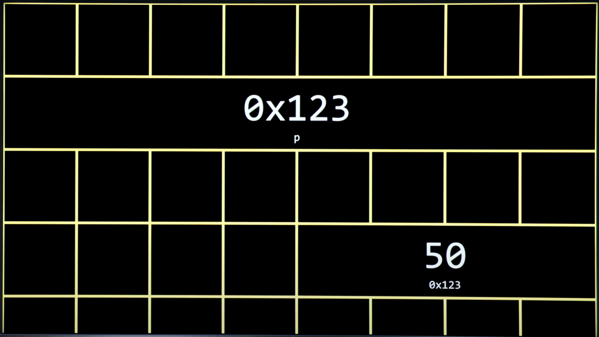

# Week 4 - Memory

[Link to Problem Set 4](https://cs50.harvard.edu/x/psets/4/)

## Index
- [Pointers](https://cs50.harvard.edu/x/shorts/pointers/)
  - [Hexadecimal notation](https://cs50.harvard.edu/x/shorts/hexadecimal/)
- New operators
- Pointer arithmetic
- Strings are not a thing in C
- [Dynamic memory allocation](https://cs50.harvard.edu/x/shorts/dynamic_memory_allocation/)
  - Functions to allocate memory
- valgrind
- Passing by value vs. Passing by reference
- Buffer overflows
- file I/O (file input and output)
- [Defining custom types](https://cs50.harvard.edu/x/shorts/defining_custom_types/)
- [Call Stacks](https://cs50.harvard.edu/x/shorts/call_stacks/)
- [File pointers](https://cs50.harvard.edu/x/shorts/file_pointers/)

## Notes from lecture
### Pointers
A pointer is a variable that stores the address of something.

#### Hexadecimal notation

0 1 2 3 4 5 6 7 8 9 A B C D E F \
The letters replace 10, 11, 12, 13, 14, 15 so we don't use two digits. The letters can appear as upper or lower case, it makes no difference.

Numbers are represented in powers of 16, so: \
Hexadecimal | Decimal \
00 | 0 \
01 | 1 \
02 | 2 \
0A | 10 \
0F | 15 \
10 | 16 \
11 | 17 \
20 | 32 \
FF | 255 \
etc...

By convention, when you write things in hexadecimal, you write "0x" before the digits, so: \
0x00 | 0 \
0x01 | 1 \
0x02 | 2 \
0x0A | 10 \
0x0F | 15 \
0x10 | 16 \
0x11 | 17 \
0x20 | 32 \
0xFF | 255

#### New operators
"&" - "address of" operator, the compiler will tell you where your variable is located in the computer \
"*" - "de-reference" operator, have an address and go there, it tells you how to get to something \
"%p" - allows to print pointers

````
int n = 50;

int *p = &n;
````

to print the address of n in your computer, you can:
````
int main(void)
{
    int n = 50;
    int *p = &n;
    printf("%p\n", p);
}
````
or simpler:
````
int main(void)
{
    int n = 50;
    printf("%p\n", &n);
}
````

If I want to print the value of n (50), I can go to the location of the value with its pointer after creating it and print that:
````
int main(void)
{
    int n = 50;
    int *p = &n;
    printf("%i\n", *p);
}
````

As we see, the * symbol can mean "go there" or can be used to declare the pointer variable. That, on top of its multiplication functionality. 

So:
- p is a variable whose value happens to be an address
- n is an integer at that address

While integers use 32 bits (4 bytes), pointers are normally 64 bits (8 bytes):


#### Pointer arithmetic

#### Strings are not a thing in C
Strings actually don't exist as a data type in C, we have been using them with the CS50 library, which we wouldn't use in actual coding. Instead, we tell the computer to remember the location of the first chacter of the string. Therefore,
````
string s = "HI!"
````
can be writen as
````
char *s = "HI!"
````

#### Functions to allocate memory
malloc - memory allocation \
free - give back memory, make it free again after using again

If we want to copy a string in a variable into another variable, simply doing
````
char *s = "HI!"
char *t = "HI!"
````
will not work as expected and will lead to problems. For example, if we want to change of the characters in t but not in s. Since we are telling the computer the location of t is exactly the same as the location of s, changing one will affect the other, they are pointing to the same address. \
If we wanted to change the capitalization of a user given string, but printing both the old capitalization and the new, we have to avoid the problem we just described. We can instead allocate memory to t, and then copy the characters in s into t with a for loop:
````
#include <cs50.h>
#include <ctype.h>
#include <stdio.h>
#include <stdlib.h>
#include <string.h>

int main (void)
{
    char *s = get_string("s: ");

    char *t = malloc(strlen(s) + 1);

    for (int i = 0, n = strlen(s); i <= n; i++)
    {
        t[i] = s[i];
    }

    t[0] = toupper(t[0]);

    printf("s: %s\n", s);
    printf("s: %s\n", t);
}
````

In cases of error (for example, there could be no more memory available), malloc returns NULL, which is the address 0. We can add error checks, code to catch these errors, and stop our program if this happens.
````
#include <cs50.h>
#include <ctype.h>
#include <stdio.h>
#include <stdlib.h>
#include <string.h>

int main (void)
{
    char *s = get_string("s: ");

    char *t = malloc(strlen(s) + 1);

    if (t == NULL)
    {
        return 1;
    }

    for (int i = 0, n = strlen(s); i <= n; i++)
    {
        t[i] = s[i];
    }

    t[0] = toupper(t[0]);

    printf("s: %s\n", s);
    printf("s: %s\n", t);
}
````
We should develop a sense to code defensively. If we touch memory that doesn't belong to us, errors will happen (the program will stop, the computer will freeze...). In this example, we could catch one more error. Since the string s is user generated, it could be completely empy because the user doesn't type it anything. In that case, t will also be empty, so we don't want to try to capitilise an empty character. We can add another error check as follows:
````
#include <cs50.h>
#include <ctype.h>
#include <stdio.h>
#include <stdlib.h>
#include <string.h>

int main (void)
{
    char *s = get_string("s: ");

    char *t = malloc(strlen(s) + 1);

    if (t == NULL)
    {
        return 1;
    }

    for (int i = 0, n = strlen(s); i <= n; i++)
    {
        t[i] = s[i];
    }

    if (strlen(t) > 0)
    {
        t[0] = toupper(t[0]);
    }

    printf("s: %s\n", s);
    printf("s: %s\n", t);
}
````
After we're done, completely done (the program has done everything we want it to do), we should (must) free the memory to avoid a memory leek, adding at the end of the code the free function:
````
free(t)
````

#### valgrind
Debugger similar to debug50, but used to detect memory related mistakes in our code. Used in the terminal window as
````
valgrind ./memory
````
#### Passing by value vs. Passing by reference (or address)

#### Buffer overflows
- Heap overflow: if you call malloc too many times, you might allocate areas of memory needed for the stack.
- Stack overflow: if you call too many functions, you can overflow the stack into the heap or into each other.

#### file I/O (file input and output)
Functions that operate on files:
- fopen
- fclose
- fprintf
- fscanf
- fread
- fwrite
- fseek

A data type FILE exists in C to operate with files.

To add user generated data to a previously created phonebook.csv file:
````
#include <cs50.h>
#include <stdio.h>
#include <string.h>

int main(void)
{
  FILE *file = fopen("phonebook.csv", "a");
  if (file == NULL)
  {
    return 1;
  }

  char *name = get_string("Name: ");
  char *number = get_string("Number: ");

  fprintf(file, "%s,%s\n", name, number);

  fclose(file);
}
````
