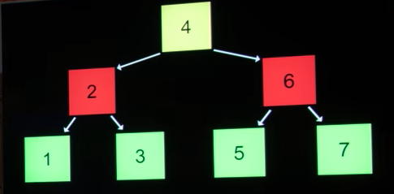
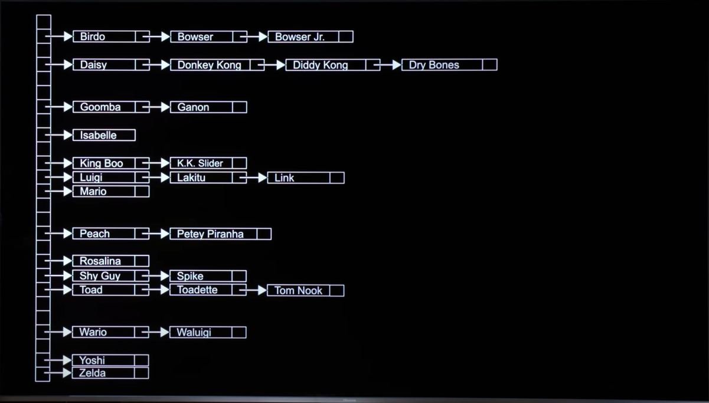
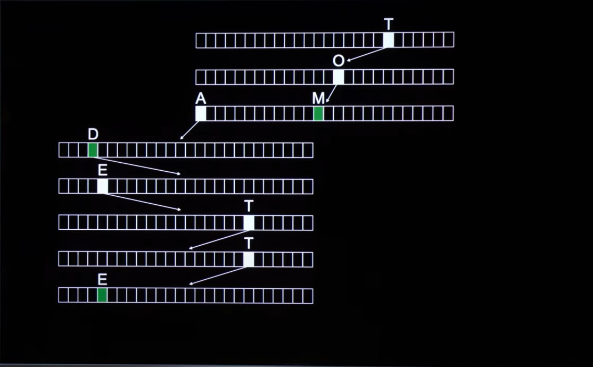

# Week 5 - Data Structures

[Link to Problem Set 5](https://cs50.harvard.edu/x/2025/psets/5/)

## Index
- [Structures](https://cs50.harvard.edu/x/2025/shorts/structures/)
- Abstract data types
  - [Queues](https://cs50.harvard.edu/x/2025/shorts/queues/), FIFO
  - [Stacks](https://cs50.harvard.edu/x/2025/shorts/stacks/), LIFO
- [Data structures](https://cs50.harvard.edu/x/2025/shorts/data_structures/)
  - Linked lists
    - [Sigly-Linked Lists](https://cs50.harvard.edu/x/2025/shorts/singly_linked_lists/)
    - [Doubly-Linked Lists](https://cs50.harvard.edu/x/2025/shorts/doubly_linked_lists/)
  - Trees
    - Binary search trees
  - Dictionaries
  - Hashing and [Hash Tables](https://cs50.harvard.edu/x/2025/shorts/hash_tables/)
  - [Tries](https://cs50.harvard.edu/x/2025/shorts/tries/)

## Notes from lecture

### Abstract data types
#### Queues, FIFO

A queue in the real worls is a FIFO in data type. First in, first out.
````
enqueue
dequeue
````

````
const int CAPACITY = 50;
typedef struct
{
  person people[CAPACITY]
  int size;
} queue
````
I have to keep track of the capacity (constant) of a queue, but also its size. Size is the current number of things actually in the queue. 

#### Stacks, LIFO
Opposite of queues, in the sense that the last thing I put in is the first thing coming out. \
They are LIFO: Last in, First out.
````
push
pop
````

````
const int CAPACITY = 50;
typedef struct
{
  person people[CAPACITY]
  int size;
} stack
````
The only difference from a queue in code when creating a stack is the last line where we name the data type.

### Data structures
````
struct
.
*
````
Using these 3 we can build almost anything we want related to structures.

````
typedef struct node
{
  int number;
  struct node *next;
} node;
````
Nodes are containers for data. In this case, the node stores a number, and the address to the next node.

#### Linked lists

#### Trees
##### Binary search trees


A node in a binary search tree can look like:
````
typedef struct node
{
  int number;
  struct node *left;
  struct node *right;
} node;
````
Binary search trees use more memory but they are commonly use because they are useful in many cases.

#### Dictionaries
Dictionaries associate keys with values. Keys are very often strings (like someones name), values are often strings, numbers or even structures (if you want to include multiple information in one key). 

#### Hashing and Hash Tables
Hashing relates to what is called a hash function. The idea of a hash function is that it allows you to decide where some value goes in memory. \
Backet is a term of art in computing. To baketize something is puting an input into a location. \
Using hash functions we can build hash tables. Hash tables are the offspring of an array and a linked list together, somehow a combination of the two. It can get us closer to constant running time.



The structure could be:
````
typedef struct node
{
  char *name;
  char *number;
  struct node *next;
} node;
````

#### Tries
'Tries' is short for retrieval. \
A trie is tree of arrays. It should give us true constant running time. 



