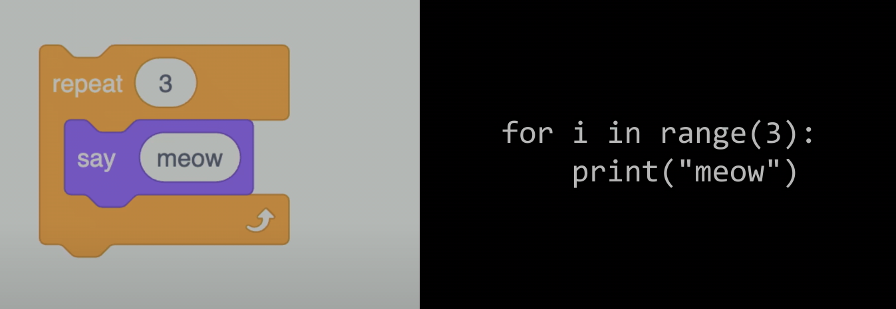

# Week 6 - Python

[Official Python documentation](https://docs.python.org/3/) \
[Link to Problem Set 6](https://cs50.harvard.edu/x/2025/psets/6/)

## Index
- [Python](https://cs50.harvard.edu/x/2025/shorts/python/)
- Libraries (modules and packages)
- Positional parameters vs Named parameters
- Python data types
- Python data structures
- Input function
- Conditionals
- OOP - Object-Oriented Programming & Methods
- Loops
- Truncation
- Exceptions
- Lists and dictionaries
- Command line arguments

## Notes from lecture

### Libraries 
Are generaly called modules and packages.
You can import a whole library
````
import cs50
````
or specific functions from a library
````
from cs50 import get_string
````

### Positional parameters vs Named parameters
With positional parameters, the order in which you provide arguments matters; each argument is assigned to a parameter based on its position. \ 
With named parameters, you explicitly specify which argument corresponds to which parameter by name, so the order doesn't matter. \
In Python, there's **both**. For example, in the print function, the object (what you want to print) is a positional parameter (it comes first) and there's other named parameters to indicate what separates objects, and how the print ends. The print function, as per its documentation, admits the following parameters:
````
print(*objects, sep=' ', end='\n', file=None, flush=False)
````

### Python data types
- bool
- float
- int
- str
- ...

### Python data structures
- range
- list
- tuple
- dict
- set
- ...

### Input function
Pyhton has its own input function, which is similar to get_int and get_string in the cs50 library. However, the value that comes from python's input function will be stored as a string, so if we do
````
x = input("x: ")
y = input("y: ")

print(x + y)
````
and we say x is 1, and y is 2, the printing result will be 12, since they're considered strings and they're just concatenated. We can easily fix this indicating that the input will be an int:
````
x = int(input("x: "))
y = int(input("y: "))

print(x + y)
````

### Conditionals
Indentation matters in Python. You MUST indent 4 spaces to include something inside the conditional.

If conditional:
````
if x < y:
  print("x is less than y")
````

If, else:
````
if x < y:
    print("x is less than y")
else:
    print("x is not less than y")
````

If, else if, else:
````
if x < y:
    print("x is less than y")
elif x > y:
    print("x is not less than y")
else:
    print("x is equal to y")
````

Comparing ints is pretty similar as it was in C, however comparing strings is different. Comparing strings in C was a bit weird cuz it's really a char* bla bla bla, and you're really comparing the addresses, so we needed a specific library and function to compare strings.\
In Python, however, comparing strings is more straightforward and we can compare strings directly:

````
s = input("s: ")
t = input("t: ")

if s == t:
    print("Same")
else:
    print("Different")
````

### OOP - Object-Oriented Programming & Methods
Python is an object-oriented language. \
Methods are functions that are associated with a data type (or object). Among the methods that come with strings, there's one called lower (to lowercase).
````
s = input("Do you agree? ")
t = s.lower()
````
You can also chain methods in longer functions like:
````
s = input("Do you agree? ").lower()
````

### Loops



### Truncation

### Exceptions
Exceptions are basically errors in python.

### Lists and dictionaries

### Command line arguments
We can add command line arguments using the sys library:
````
from sys import argv
````

so with the "hello, world" example, we can do:
````
from sys import argv

if len(argv) == 2:
  print(f"hello, {argv[1]}")
else:
  print("hello, world")
````
