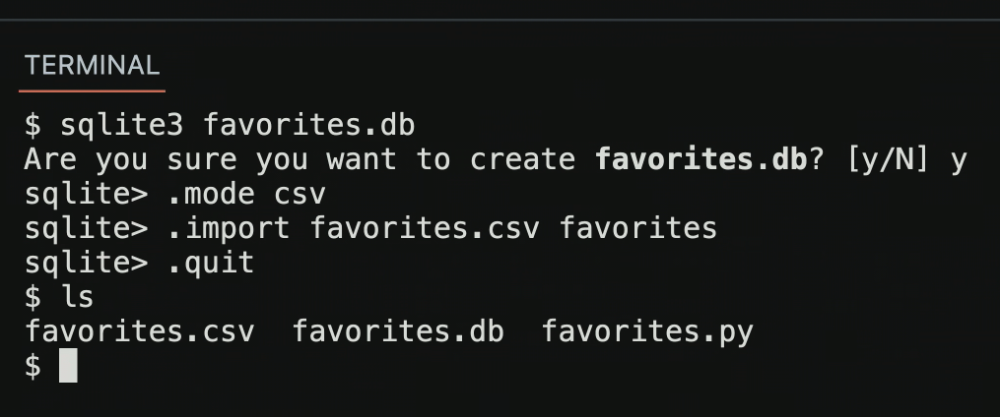
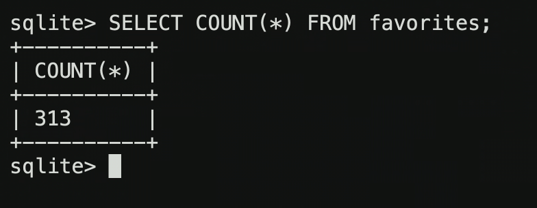
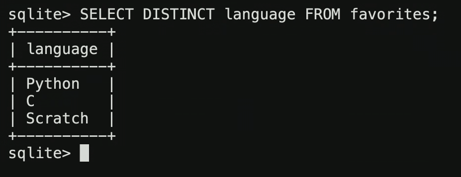
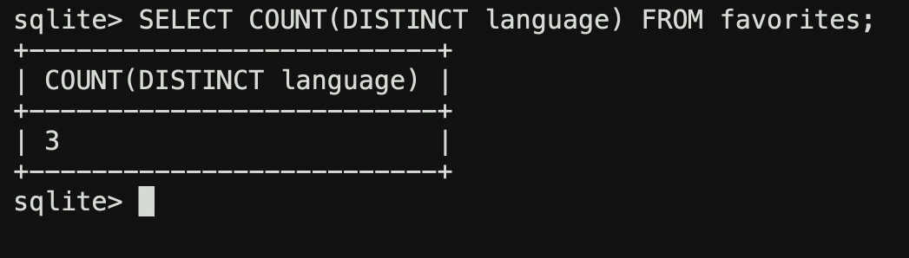
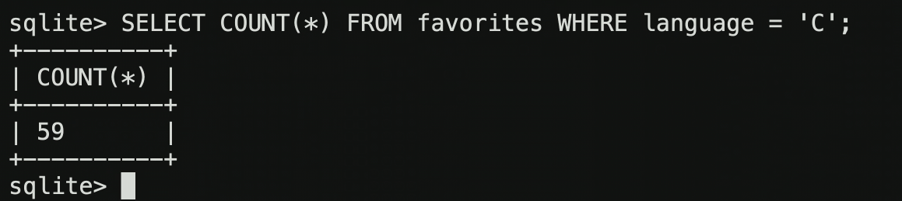
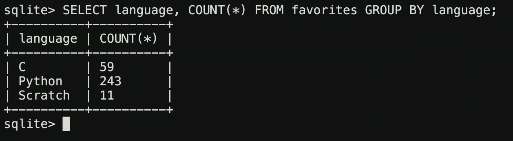
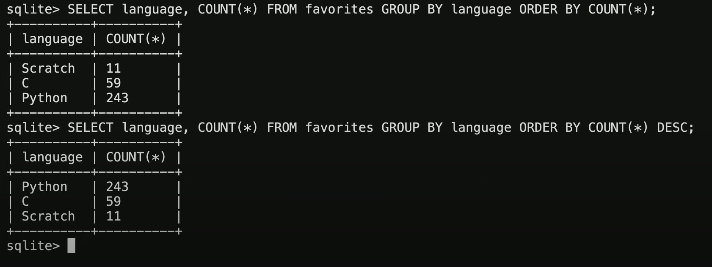
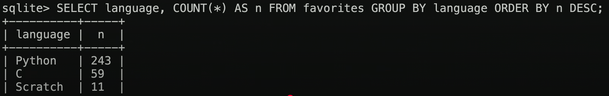
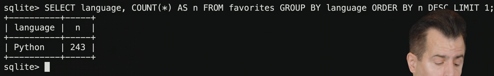
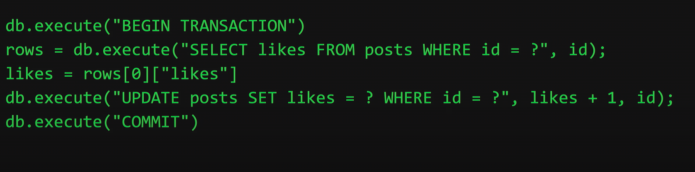

# Week 7 - SQL

[CS50 SQL Library for Python](https://cs50.readthedocs.io/libraries/cs50/python/#cs50.SQL) \
[SQL Style Guide](https://www.sqlstyle.guide/) \
[SQL Keywords Reference](https://www.w3schools.com/sql/sql_ref_keywords.asp) \
[Link to Problem Set 7](https://cs50.harvard.edu/x/2025/psets/7/)

## Index
- CSV docs, Comma Separated Values
- Relational databases
- [SQL](https://cs50.harvard.edu/x/2025/shorts/sql/), Structured Query Language
- SQL Keywords
- sqlite Data types
  - Keywords for data types
- JOIN
- Indexes
  - B-trees
- Race conditions
- SQL Injection attacks

## Notes from lecture
SQL (Structured Query Language) is a programming language specifically designed for databases. \
SQL supports 4 functionalities, CRUD:
- CREATE
- READ
- UPDATE
- DELETE
You can techically do more things, like INSERT or DROP, but they come down to those 4 functionalities.

The data is stored in **tables**, and tables store data in rows and columns. In the world of relational databases, you have tables instead of spreadsheets.

We will use here **sqlite3**. It stores all of your data in a file in your hard-drive or the cloud. Other databases, like MySQL or others, use very very similar language with small changes, dialogues if you will.

There's different file extensions for databases. In the world of sqlite, .db is a common one. 



Cannonical SELECT function in SQL:
````
SELECT columns FROM table;
````
We can select everything in our table with:
````
SELECT * FROM favorites;
````

### SQL Keywords
- AVG
- COUNT
- DISTINCT
- LOWER
- MAX
- MIN
- UPPER
- ...







- GROUP BY
- LIKE
- LIMIT
- ORDER BY
- WHERE
- ...







- AS renames a column



- LIMIT limits the results to the number provided



### sqlite Data types
- BLOB (binary large object)
- INTEGER
- NUMERIC (things like dates, years, times)
- REAL
- TEXT
#### Keywords for data types
- NOT NULL
- UNIQUE
- PRIMARY KEY
- FOREIGN KEY

### JOIN

### Indexes
````
CREATE INDEX name ON table (column, ...);
````
#### B-trees
The database creates these b-trees in the background when we INDEX. The b-trees allow for quicker search (binary search, for example, tho the teacher said the 'b' in 'b-tree' doesn't stand for 'binary'). They work similarly to a hash table in C, where values are stored in some specific order in a tree and therefore are easier to find for the database.

### Race conditions
- BEGIN TRANSACTION
- COMMIT
- ROLLBACK
A transaction allows you to say to the database "all of these queries, or none of them". This is useful when the same query could be happening more than one time at the time if different users activate it, like it is the case for counting likes on Instagram. We want the full query to run before the next query can happen, so we put it in a transaction:



### SQL Injection attacks
A user could try to attack you through a user input in your database. \
Trusting user input = BAD. 
