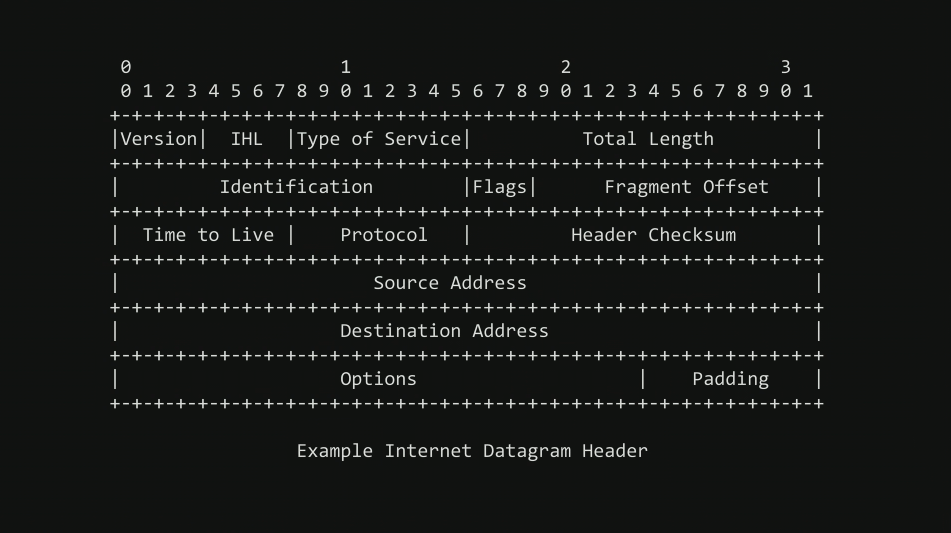
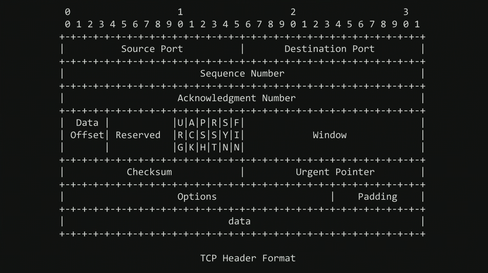
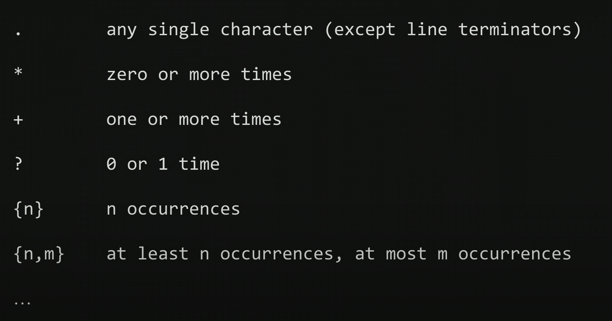
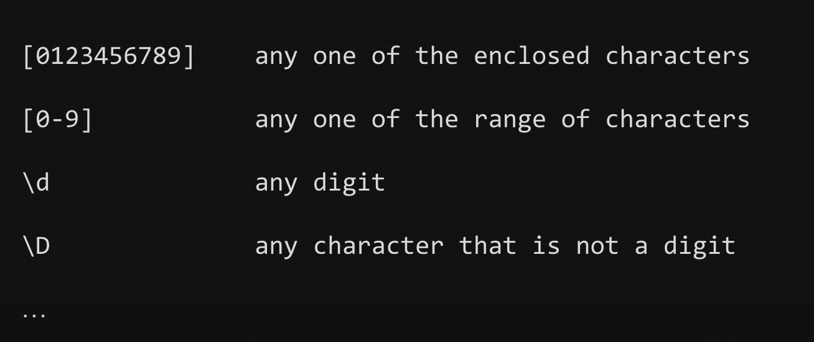
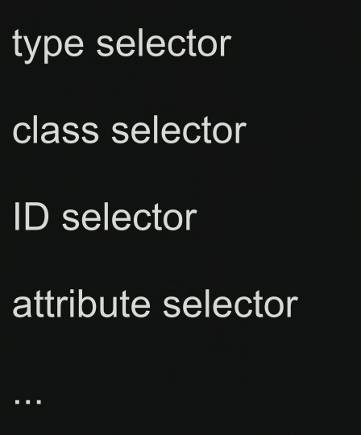
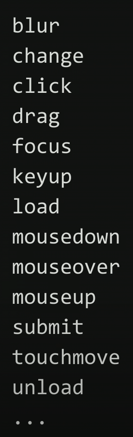

# Week 8 - HTML, CSS, JavaScript

[HTML validator](https://validator.w3.org/) \
[Bootstrap frameworks](https://getbootstrap.com/) \
[Link to Problem Set 8](https://cs50.harvard.edu/x/2025/psets/8/)

## Index
- [Internet](https://cs50.harvard.edu/x/2025/shorts/internet_primer/)
  - Routers
  - [TCP](https://cs50.harvard.edu/x/2025/shorts/tcp/) / [IP](https://cs50.harvard.edu/x/2025/shorts/ip/)
  - DNS
  - DHCP
  - [HTTP](https://cs50.harvard.edu/x/2025/shorts/http/) / HTTPS
- [HTML](https://cs50.harvard.edu/x/2025/shorts/html/)
  - regexes - Regular expressions
- [CSS](https://cs50.harvard.edu/x/2025/shorts/css/)
  - Frameworks
- [JavaScript](https://cs50.harvard.edu/x/2025/shorts/javascript/)
  - Conditionals
  - Variables
  - Loops
- [DOM, Document Object Model](https://cs50.harvard.edu/x/2025/shorts/dom/)

## Notes from lecture
### Internet
#### Routers 
are simply computers whose job is route the information from one server to another.
#### TCP / IP
The protocols/language that routers use. \
IP stands for Internet Protocol. It's the protocol computers speak when trying to send information between each other. A protocol is a set of conventions. It's not so much a language, but a set of conventions. Every computer in the world that's connected to the internet has an IP address that is #.#.#.# Since that only allows for 8 billion addresses, the world now starts to use IP version 6, but most people are still using IP 4.



TCP IP garanties delivery of information. It solves a few problems. One of them being that, when we send too big files that are diveded in different "deliveries", we keep track of each piece of information. \
It also defines a convention that we call ports. A port is a numeric identifier for an internet service. To uniquile identify world wide web traffir, we use 80 (HTTP), or when it's secure 443 (HTTPS). 



#### DNS
Domain Name System servers are somewhere in between you and the rest of the world. They translate domain names to IP addresses. Techniccaly those domain names are called Fully Qualified Domain Name.

#### DHCP
Dinamic Host Configuration Protocol. It governs how your device gets its IP address, and which DNS server to use.

#### HTTP / HTTPS
They are used in URLs, Uniform Resource Locators. \
Top level domains are .com (commercial), .gov (governmental), etc. \
HTTP is the protocol. It uses keywords such as GET and POST. 

### HTML
HiperText Markup Language. It is not a programming language, so the basics is fairly straightforward. \ 
It has tags and attributes.

http-server - vscode command to create server

#### regexes - Regular expressions 
Regular expressions are patterns that allow you to validate user input.




### CSS
Cascading Style Sheets. They use properties: key-value pairs.



#### Frameworks
Libraries made by 3rd parties to make web aesthetics easier to implement.

### JavaScript
"Proper" programming language, with functions, arguments, loops... \
JavaScript is event-driven:



#### Conditionals
````
if (x < y)
{

}
else if (x > y
{

}
else
{

}
````

#### Variables
````
let counter = 0;
````

````
counter = counter + 1
counter +=1;
counter++;
````

#### Loops
````
for (let i = 0; i < 3; i++)
{

}
````

````
while (true)
{

}
````
