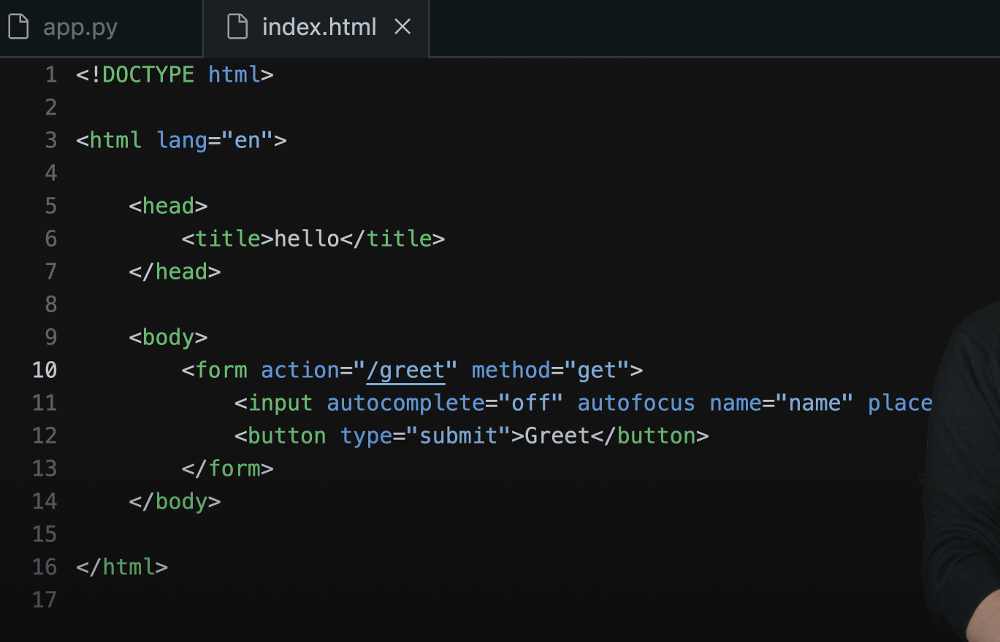

# Week 9 - Flask

[Link to Problem Set 9](https://cs50.harvard.edu/x/2025/psets/9/) \
[Jinja Templates documentation](https://jinja.palletsprojects.com/en/stable/templates/)

## Index
- [Flask](https://cs50.harvard.edu/x/2025/shorts/flask/)
- HTML into Flask
- Placeholders
- Forms
- Jinja
- POST request method
- Server site validation
- Using SQL and Databases with Flask
- Cookies, sessions, log-in, shopping carts
- API, Application Programming Interface
  - JSON, JavaScript Object Notation
- [AJAX](https://cs50.harvard.edu/x/2025/shorts/ajax/)

## Notes from lecture
We're gonna use code to generate pages through programming. 

We refer to paths to refer to everything after the main URL:

````
https://www.example.com/path
````

In the context of web programming, you can specify paths that don't exist in your code space, but that specify a resource you want to access in your browser.
````
https://www.example.com/route
````
- Back end: the part that only the programmer uses and tocuches.
- Front end: the part the user touches.

When you request something like to Google, the code in the background is something like
````
GET /search?q=cat HTTP/2
Host: www.google.com
...
````

### Flask
Flask is a very popular micro-framework (or a very small library) in the world of Python, that solves some very common problems.

Today we'll use the command **flask run** instead of **http-server** so we can run a server that's smarter and can generate web pages dinamically, rather than just running static HTML/CSS/etc.

The flask command will require two docs to run:
- app.py
- requirements.txt


With this code in app.py we can run an application with flask in python.

In requirements.txt we want to write all the libraries that are needed to run our application. In this case, it would only be Flask. To install the needed applications from a requirements.txt file, we can run the following command in our terminal window:
````
pip install -r requirements.txt
````

### HTML into Flask

The function render_template (part of Flask) allows us to read an HTML document in Python so it can be returned.


### Placeholders

Placeholders, when using Flask, should be in between {{ }} in your HTML file:


To use the placeholder we need to add the request function into Flask.

**request.args** creates a python dictionary for our webpage based on the additional user input appearing in the URL


To fix this:


Of course, in real life, we would want to give a different name to the placeholders rather than 'placeholder', so we can use multiple of them.

It can be written more easily avoiding the if function with the get method, which allows us to include a placeholder and a default value if the placeholder isn't found:


### Forms

However, for the previous example to work the user would need to manually add the route to the url:
````
.../?name=David
````

To create a form that allows the user to type in their name and having the URL automatically changed, we would need to edit our .html and .py docs as follows:




HOWEVER doing this will give as an Internal Server Error, an error that means we, the programmers, have made a mistake. In this case, the mistake is that we're missing a library which Flask uses to create templates.

### Jinja

We need to add the Jinja library so we can use the functionality of dinamically creating new templates.

The previous code will now work, as long as we create a layout.html file with everything that's common to the pages and have placeholders, and in the specific .html files just add what's different between the pages.

### POST request method
We can to maintain users' privacy and avoid showing the user input in the URL using the POST method instead of the GET method. If we do this, we need to adjust our python code to include the POST method and \
**request.form** is to be used instead of **request.args**


### Server site validation
Never rely on client side validation (validation only in HTML), always check server site for valid values. 

### Using SQL and Databases with Flask

### MVC
MVC is one type of architecture where you separate concerns. These are industry standard labels.
- **Model** has the databases in the backend.
- **Controller** is our .py file controlling the site.
- **View** are all the templates (html) the user actually sees.


### Cookies, sessions, log-in, shopping carts
**session** is a feature of Flask built with cookies that helps the site remember a specific user. We can remember, for example, that someone is logged in via these cookies.

### API, Application Programming Interface
It's a way of standardise how you provide input to a service and how you get output.

#### JSON, JavaScript Object Notation
Normally when it comes to API you shoulnd't be sending back snippets of HTML, but really the raw data. So in the world of APIs, we use JASON, so we can send back the equivalent of a dictionary.

### Ajax
Formerly the named standed for Asynchronous JavaScript and XML, tho nowadays it tends to be used with Json instead of XML, but the acronym has stayed for the technique. \
**Ajax** allows us to dynamically update a webpage even more dynamically.

- Central to our ability to asynchronously update our pages it to make use of a special JavaScript object called an XMLHttpRequest.
````
var xhttp = new SMLHttpRequesrt();
````
- After obtaining your new object, you need to define its onreadystatechange bahaviour.
  - This is a function (tipically an anonymous function) that will be called when the asynchronous HTTP request has completed, and thus typically defines what is expected to change on your site.
- XMLHttpRequests have two additional properties that are used to detect when the page finished loading.
  - The readyState property will change from 0 (request not yet initialized) to 1, 2, 3, and finally 4 (request finished, response ready).
  - The status property will (hopefully!) be 200 (OK).
- Then just make your asunchronous request using the open() method to define the request and the send() method to actually send it.
  - There is a slightly different way to do this syntactically with jQuery.
 
This is how it works:
````
function ajax_request(argument)
{
  var aj = new XMLHttpRequest();
  aj.onreadystatechange = function() {
    if aj.readyState == 4 && aj.status == 200)
      // do something to the page
  };

  aj.open("GET", /* url */, true);
  aj.send();
}
````

- More commonly, you'll see Ajax requests written using jQuery instead of "raw" JavaScript as in the example above. More info on jQuery is [here](http://api.jquery.com/jquery.ajax/).
